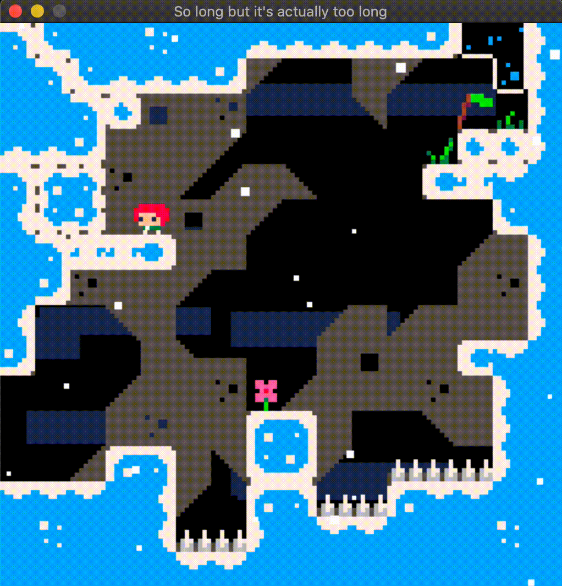

# SoLong Celeste

<div align="center">
  
</div>

*You can do this!*

## Table of Contents
* [Introduction](#introduction)
* [Gameplay](#gameplay)
* [How it Works](#how-it-works)
* [How to Play](#how-to-play)

## Introduction

`so_long` is the first graphical project created at 42. The goal is to build a basic 2D game using the school's graphical library, `minilibx`.

As Celeste is my favorite game of all time, I decided to recreate it for this project. However, to simplify things, I focused on recreating the [Pico-8 version](https://www.lexaloffle.com/bbs/?tid=2145) of the game, which was made by Maddy Thorson and Noel Berry in just 4 days!


## Gameplay

Celeste is a hardcore platformer that requires quick reflexes and precision. Given its difficulty, the controls are simple—just six keys: the four arrow keys for movement, a jump key, and a [dash](#dash) key.

### Dash

The dash is Celeste's signature mechanic. It’s like a second jump that you can use while in the air. You can dash in 8 different directions, depending on which movement key(s) you are pressing. For example, pressing `left` and `up` together will make you dash diagonally.

If no movement keys are pressed, you will dash in the direction you're facing.

### Strawberries

Some levels contain one or more strawberries to collect. These are completely optional (at least in the `bonus` version), but they add an extra challenge. As the original game says:
> "Strawberries will impress your friends, but that's about it. Only collect them if you really want to!"

### Secret Walls



> Some walls seem a bit suspicious—what might they be hiding?

### Quality of Life Improvements

Just like in the original game, I’ve added a few quality-of-life (QoL) improvements such as `jump grace` and `jump buffering`.

- **Jump grace**:  
	Allows you to jump for a few frames after leaving a platform. In this game, you have 6 frames to jump after stepping off the platform.
  
- **Jump buffering**:  
	Allows you to press the jump key just before landing, and still jump as soon as you touch the ground. Here, you can jump within 6 frames before landing.

## How it Works

For the graphical part of the project, I used a library called `minilibx`, which is somewhat outdated but sufficient for the task.

To streamline the use of this library, I developed a simple game engine called [SnowFlakeEngine](https://github.com/Alienxbe/SnowFlakeEngine).

I also relied on my enhanced version of [Libft](https://github.com/Alienxbe/libft), which now includes `ft_printf`, `get_next_line`, and many new utility functions.


### Part 1: Parsing

In this part of the code, I ensure the provided map file is valid by checking that it was properly opened and has the `.ber` file extension. I then proceed to read the file line by line using `get_next_line`, adding each line to a linked list. Each element of the list contains an array of integers (`int *`).

As each line is read, its content is parsed for special characters like `P`, `C`, `E`, etc. (refer to the [Maps](#maps) section for more details). These special characters are not stored directly in the map; instead, their positions are recorded elsewhere. The player’s position is stored in a dedicated variable, and the exit flag is similarly handled. Coins and secret walls are treated as entities, with their positions stored in separate linked lists.

In the final map, the positions of these special characters are replaced with void (`0`). Once the parsing is complete and no errors are encountered, I concatenate all the lines in the linked list to create the final 2D array of integers (`int **`) representing the map.

The map structure returned is as follows:
```C
typedef struct s_map
{
	int	**tab;		// The map itself
	t_point	player_pos;	
	t_point	exit_pos;
	t_dlist	*strawberries;	// List of coins (entities)
	t_dlist	*secret_walls;	// List of secret walls (entities)
	t_point	size;		// Map size
	t_point	pixel_size;	// Map size in pixels (t_map.size * SPRITE_SIZE)
}	t_map;
```

### Part 2: Game initialisation

Most of the 'hard' stuff with the minilibx is done by my `SnowFlakeEngine` so this part is pretty easy. To understand how it works, I have to explain you the logic of my game engine.

It works with a system of scenes called `t_scene`. We don't have to know what's inside this structure because it's automatically created with `sfe_new_scene()` except that there are 3 important function pointers called `f_init`, `f_update` and `f_destroy`. This `t_scene` works a little bit like a parent in OOP, so that's why you have to create a new structure that will *inherit* from it (here `t_sc_main`). As you can see in the code below, I also have to set my new scene (`t_sc_main`) as the new active scene with `sfe_set_active_scene`. When this function is called it will also call the `f_init` function passed to my scene, and a little bit later I will start my main loop using the `sfe_loop()` function and it will call every time the `f_update()` function. This loop also calculates my fps and can also limit it using the `usleep()` function to make it constant. Once the function `f_update` returns `0` the loop will end and call `sfe_exit()` wich finally calls the `f_destroy` function.

The scene from SFE also creates an image (`t_img`) when it's initialised. An upgraded version of the minilibx image, where I can draw / copy sprite on. This image is the only one that is called with the `sfe_put_img_to_window()`, my equivalent of the `mlx_put_img_to_window()`.


```C
/*
** Here is my initialisation function to help you understand my bad explanation better
*/

typedef struct s_sc_main
{
	t_game		*game;		// A pointer to my main structure containing all the game data
	t_bool		running;	// Is it running ?
	t_scene		scene;		// The scene structure from SFE | *parent class*
	t_sfe		*sfe;		// A pointer to the SFE instance
}	t_sc_main;

static void	init_window(t_sfe **sfe, t_sc_main *sc)
{
	t_point	win_size;

	win_size = (t_point){sc->game->map.pixel_size.x,
		sc->game->map.pixel_size.y + STATS_BAR_SIZE};
	*sfe = sfe_init(WIN_NAME, win_size);	// Call the init function
	sfe_set_max_fps(*sfe, 60);
	sc->scene = sfe_new_scene(*sfe, sc);
	sc->scene.f_init = &sc_main_init;
	sc->scene.f_update = &sc_main_update;
	sc->scene.f_destroy = &sc_main_destroy;
	sc->sfe = *sfe;
	sfe_set_active_scene(*sfe, &sc->scene);
	events_init(*sfe, sc);
}
```

In the `sc_main_init()` function I set some variables, load the sprite sheets that are divided in a list of `t_img` with my very useful `sfe_load_sprite_sheet()` function, and call the init function of every *item* of the game (player, exit, strawberries, ...)

### Part 3: Game Loop

The game loop is contained within the `sc_main_update()` function, which is called 60 times per second (or as close to that rate as possible). The loop is divided into three key phases: `erase`, `update`, and `draw`. Each game element (such as the player, exit, strawberries, etc.) also has its own set of these three functions.

1. **Erase**:  
   The `erase` functions are the first to be called. Their purpose is to remove the sprites from their previous positions by drawing a rectangle filled with the background color. Initially, I considered erasing the entire screen on every loop cycle, but this proved too slow. Instead, erasing only the elements that have moved helps reduce the amount of drawing and improves performance.

2. **Update**:  
   Next, the `update` functions are called. These functions handle recalculating and updating the variables for each game element, such as position, animation frames, state changes, or responding to key presses.

3. **Draw**:  
   Finally, the `draw` functions copy each element's sprite to its current position on the scene's `t_img`. The order in which the `draw` functions are called is critical because the last item drawn will appear in front of all others. The drawing order is as follows:

```C
void	main_draw()
{
	clouds_draw();
	map_draw();
	strawberry_draw();
	secret_wall_draw();
	exit_draw();
	player_draw();
	snowflakes_draw();
	stats_bar_draw();
}
```


### Map configuration

Maps in this project are configured using a specific format. Each map file should be a `.ber` file and consists of characters representing different elements:

- `P`: Player's starting position
- `C`: Coin (collectible)
- `E`: Exit point
- `1`: Wall
- `0`: Empty space

#### Bonus

In the bonus version, each block in the game map is represented by two characters rather than one. Special characters are prefixed with an `x`, for example, `xP` for the player's starting position.

Other blocks are represented by a 2-digit hexadecimal number, allowing for up to 256 different tiles to be drawn from the tile sheet. This system provides greater flexibility and variety in map design.

However, this format makes the maps less readable for humans. To address this, I’ve created a basic map builder tool. In the future, I plan to implement a debug mode that will allow for live map editing.

Here’s an example of what a map might look like in the bonus version:

```
090a15151415150e0e0e0e0e0b23220c
15090a0e0e0e0b2900002d2900001c0c
151509012f2d2e000000280000xE360c
0e0e0b2d2d2d2900000000003501010c
09xW262e2d29262d2700000002030f15
0d2d2d2d2d2f2d290000000000000a15
15090303042d2d000000000000262d0c
150b2e2d2d29000000000000002d2e0c
0d0000282d00000000262d262d2d2d0c
0b0000002d2a2b00002d2f2d2d020f15
000000262d2d2e34262d2d2d2e2d0c15
0000002d2e2d2d08092d0000282d0c15
00xP2608092d280a0b29003030300c15
0f0f0f150d290008093030080f0f1515
151415150d30300c150f0f1515151415
15151515150f0f151515151515151515
```


## How to Play

### Installation

This project is compatible with Linux and macOS. Unfortunately, for Windows users, the only way to play it is through a Linux virtual machine (e.g., [VirtualBox](https://www.virtualbox.org/)).

Since the project uses git submodules, you must clone the repository with the `--recurse-submodules` option:

```sh
git clone --recurse-submodules https://github.com/Alienxbe/SoLong
cd SoLong        # Move to the project directory
make             # Compile mandatory
make clean       # We have to clean before compiling bonus
make bonus       # Compiling bonus
```

Once compiled, you can run the appropriate version of the game with the following commands:
 >The second argument for the bonus version is optional and defaults to 1.
```sh
./so_long <map_path>           # Run the standard version
./so_long_bonus <map_path> [dash_count]  # Run the bonus version

```

### The Maps

The project includes a `maps/` folder divided into two sections: `bonus` and `mandatory`. It's important to note that the `bonus` maps can only be used with the bonus version (`./so_long_bonus`), and the `mandatory` maps must be played with the standard version (`./so_long`). More details on why can be found in the [Map configuration](#map-configuration) section.

```
├── maps
│   ├── bonus       # Contains visually enhanced maps
│   │   ├── *.ber
│   ├── mandatory   # Follows project specifications
│   │   ├── *.ber
│   ├── errors      # Examples of maps with intentional errors
│   │   ├── *.ber
```

While the `mandatory` maps are part of the project requirements, I highly recommend playing the `bonus` maps to experience all the features of the game. For the best experience, play the bonus maps in sequence (`maps/bonus/celeste[0->6].ber`).

> ⚠️ some maps are impossible with only one dash

## Future updates

Due to the pace system I had to go back to common core and finish this project but I have many ideas I would like to implement in a near future such as:

- Pause menu
	- control settings
- Replace step counter with timer
- Adding particles
- Death animation
- Adding new mechanics
	- Dash refill
	- Bouncer
	- Moving platforms
- Map transitioning
- Including map editor to be able to edit live (debug mode)

## Thanks

I would really like to thank Maddy Thorson and Noel Berry for creating this game and all the team that worked on the final Celeste game. It really had a huge impact on me and after more than 500h spent on this masterpiece I'm still enjoying it with the lovely community maps.

